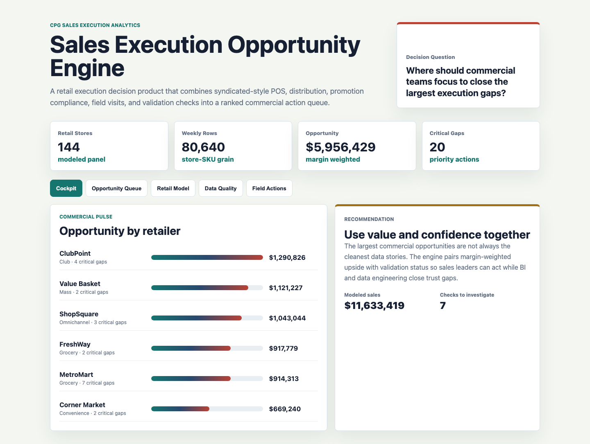
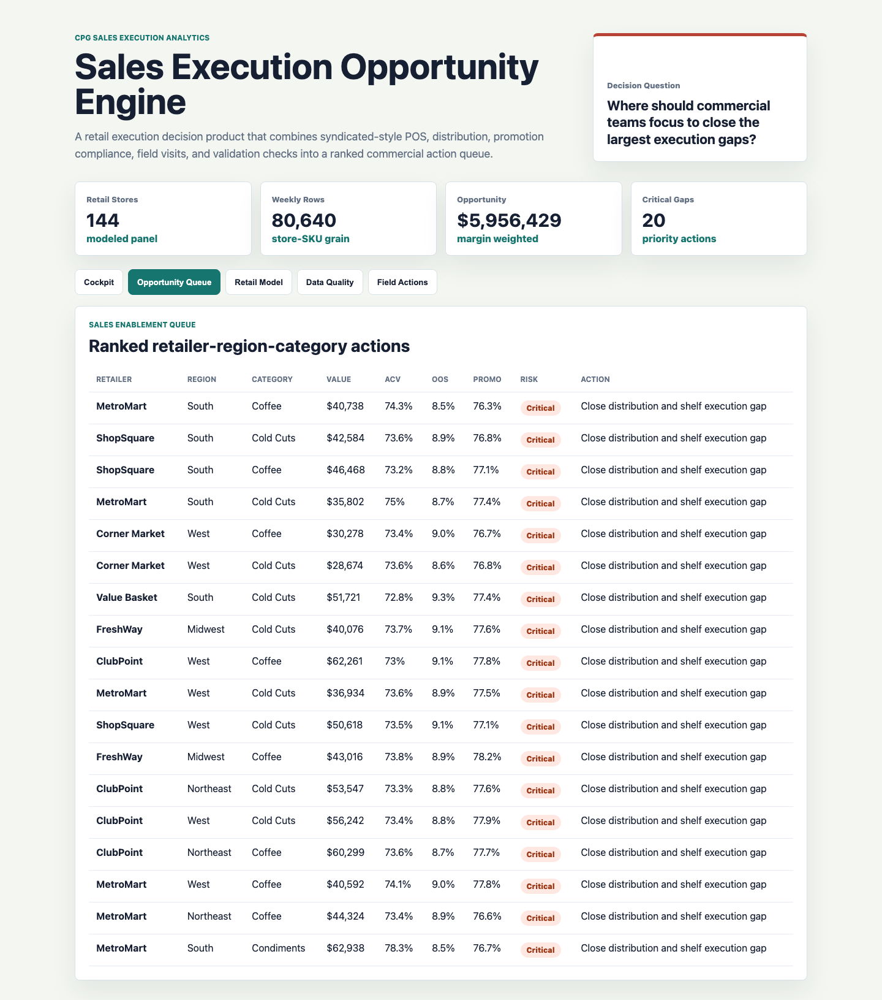
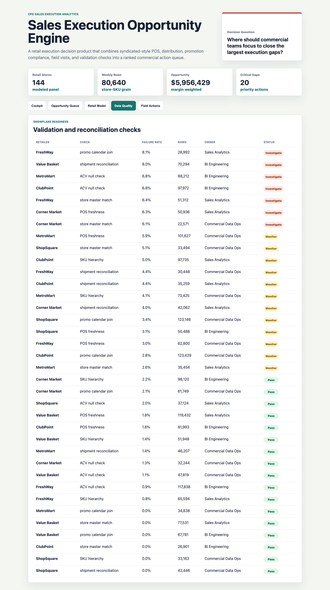

# CPG Sales Execution Opportunity Engine

A portfolio artifact for a strategic planning and insights role in a large consumer packaged goods business. The project integrates syndicated-style POS, distribution, promotion, field sales, and validation signals into a repeatable decision product for commercial analytics and sales execution teams.

The artifact is intentionally more than a dashboard. It includes reproducible synthetic operating data, an explainable retail execution opportunity model, Snowflake-style SQL checks, analysis documentation, and a multi-surface interactive console.

## Screenshots



The commercial execution cockpit shows total modeled sales, margin-weighted opportunity, critical gaps, and opportunity by retailer.



The opportunity queue ranks retailer-region-category gaps by distribution, out-of-stock risk, promotion compliance, field capacity, data confidence, and estimated margin-weighted value.



The data validation view shows POS freshness, SKU hierarchy, promo calendar joins, shipment reconciliation, and other checks that make sales enablement outputs defensible.

## What This Demonstrates

- Integration of large internal and external commercial datasets into one analytical workflow.
- Retail execution problem modeling across ACV distribution, velocity, out-of-stock rate, promotion compliance, feature support, display support, shipment lag, and field follow-up.
- PowerBI-style decision surfaces with executive, sales enablement, model, validation, and field action views.
- SQL and Snowflake-oriented thinking through explicit validation and reconciliation checks.
- Translation of complex data into clear business recommendations for sales, business unit, BI, and data engineering partners.
- Automation-ready outputs for recurring sales execution reporting and end-user adoption.

## Data Strategy

The data is synthetic because real customer POS, syndicated scanner data, shipment records, promotion calendars, and field sales records are private. It is generated with `scripts/generate_cpg_execution_artifact.py` using a fixed random seed.

The generator models a realistic CPG retail execution environment with:

- 6 retailers across grocery, mass, club, convenience, and omnichannel formats.
- 4 sales regions.
- 5 categories and 20 SKUs with margin and velocity assumptions.
- 144 modeled stores.
- 28 weeks of store-SKU execution data.
- ACV distribution, out-of-stock rate, promotion compliance, feature support, display support, unit sales, dollar sales, gross margin, and shipment lag.
- Field visit records for void gaps, display misses, promo tag issues, low shelf inventory, and planogram drift.
- Validation checks for POS freshness, store master matching, SKU hierarchy, promo calendar joins, shipment reconciliation, and ACV null checks.

Generated data includes:

- `data/stores.csv`
- `data/skus.csv`
- `data/weekly_retail_execution.csv`
- `data/promotion_calendar.csv`
- `data/field_visits.csv`
- `data/validation_checks.csv`
- `analysis/outputs/retail_execution_opportunity_queue.csv`
- `analysis/outputs/retailer_summary.csv`
- `analysis/outputs/category_summary.csv`

## Opportunity Model

The opportunity model is explainable by design. It estimates margin-weighted upside and action urgency from:

- Distribution gap versus a 92 percent ACV benchmark.
- Promotion compliance gap versus an 82 percent execution benchmark.
- Out-of-stock rate above a 5.5 percent tolerance.
- Feature and display support gaps.
- Gross margin rate.
- Open field sales follow-up capacity.
- Data validation failure rates by retailer.

Tiers:

- Critical: 29 or above.
- Watch: 23 to 28.9.
- Stable: below 28.

## Repository Structure

- `index.html`: interactive retail execution console.
- `src/app.js`: tabs, tables, charts, and calculated display logic.
- `src/data.js`: generated app payload.
- `src/styles.css`: responsive dashboard styling.
- `data/`: synthetic source-style operating files.
- `analysis/`: analysis plan, methodology, executive findings, SQL checks, and scored outputs.
- `scripts/generate_cpg_execution_artifact.py`: data and model output generator.
- `scripts/score_operating_data.py`: command-line summary of the ranked queue.
- `docs/images/`: rendered screenshots for this README.

## Run Locally

```bash
python3 -m http.server 4173
```

Then open `http://localhost:4173`.

Regenerate the synthetic data and app payload:

```bash
python3 scripts/generate_cpg_execution_artifact.py
```

Print the top scored actions:

```bash
python3 scripts/score_operating_data.py
```

## Scope

This artifact does not use real company data and does not claim to represent real performance. It is a scenario-based portfolio project designed to show how a strategic planning and insights analyst can integrate retail execution data, model commercial opportunities, validate data quality, and communicate clear recommendations across business and technical teams.
